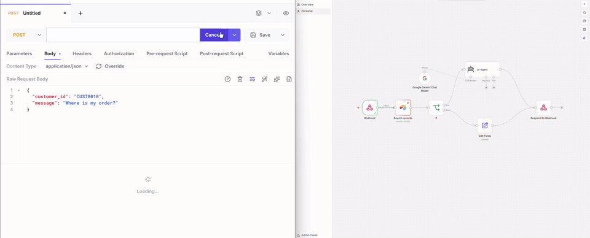
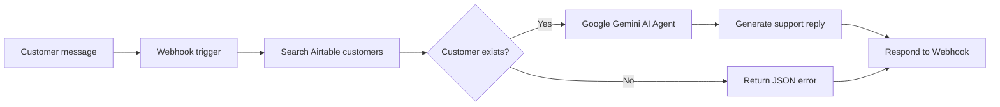
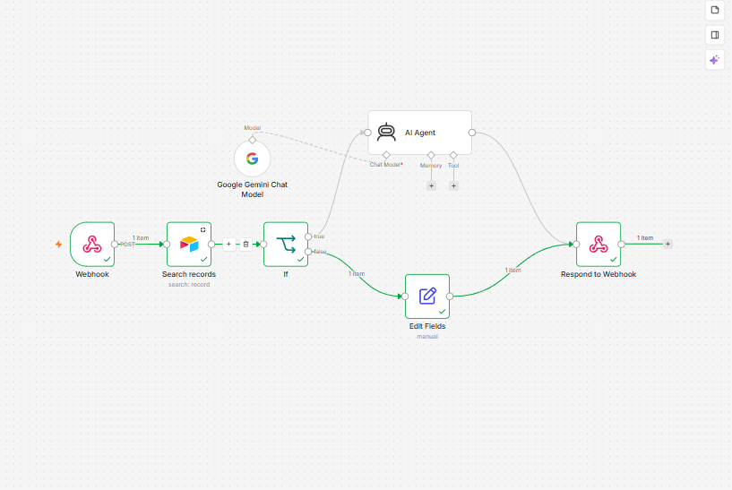
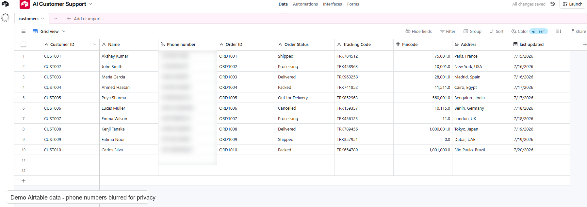
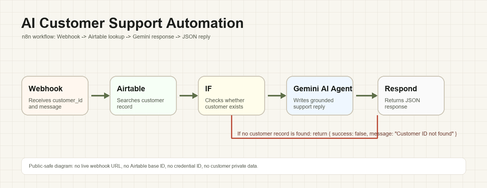

# AI Customer Support Automation

An AI-powered customer support workflow built with **n8n**, **Airtable**, **Google Gemini**, and **Webhooks**.

This portfolio project demonstrates how a support request can be received from any webhook-enabled channel, matched against customer/order data in Airtable, and answered with an AI-generated response that uses only verified database information.

> This is a portfolio automation demo. It is not presented as an enterprise production platform.

## Demo



The demo shows a webhook request sent from Hoppscotch, the n8n workflow execution path, and the JSON response returned by the automation. The live webhook URL is hidden for privacy.

## What It Does

The workflow receives a customer message, searches Airtable by `customer_id`, checks whether the customer exists, and returns either:

- a short customer-support reply generated by Google Gemini using Airtable data, or
- a structured JSON error when the customer ID is not found.

## Use Case

The webhook can represent incoming messages from platforms such as WhatsApp, Telegram, Instagram, Facebook Messenger, Discord, Slack, Microsoft Teams, a website chat widget, Shopify, WooCommerce, a CRM, or any REST API.

The demo uses a webhook because it keeps the workflow platform-independent.

## Who This Works For

Any business that receives customer questions about orders, delivery status, account information, bookings, or service updates and wants a faster first response without manually checking records every time.

| Sector | Why It Fits |
|---|---|
| E-commerce & Retail | Customers frequently ask about order status, delivery updates, and tracking codes. |
| SaaS & Software | Support teams can answer account or subscription questions using structured customer records. |
| Logistics & Delivery | Order status, shipment stage, and tracking details can be retrieved before generating a reply. |
| Hospitality & Travel | Booking status, reservation details, and guest support messages can be handled through the same pattern. |
| Education & E-learning | Student or learner records can be checked before sending personalized support responses. |
| Healthcare & Clinics | Appointment and patient-support workflows can use the same lookup-first design, with proper privacy controls. |
| Professional Services | Client status, case progress, and basic service updates can be answered from a verified database. |
| Customer Support Teams | Automates the first-pass lookup and response drafting that agents often do manually. |

If a team already stores customer information in a structured database, this workflow shows how AI can turn that data into a clear customer-facing response.

## Architecture



## Screenshots

### n8n Workflow Canvas



### Airtable Customer Table

The Airtable screenshot uses demo records. Phone numbers are blurred before publishing.



### Public-Safe Architecture Diagram



## Tech Stack

| Area | Tools |
|---|---|
| Automation | n8n |
| Database | Airtable |
| AI model | Google Gemini |
| API layer | Webhook, REST, JSON |
| Testing | Hoppscotch or Postman |

## Workflow Logic

| Step | Node | Purpose |
|---|---|---|
| 1 | Webhook | Receives a POST request with `customer_id` and `message` |
| 2 | Search records | Looks up the customer record in Airtable |
| 3 | If | Checks whether Airtable returned a matching customer |
| 4 | AI Agent | Generates a support response using only retrieved customer data |
| 5 | Edit Fields | Builds the fallback response for invalid customer IDs |
| 6 | Respond to Webhook | Returns the final JSON response |

## Important Design Decision

The AI does **not** remember customers and does **not** store customer information.

Airtable is the source of truth. The AI only receives the current Airtable record and must not invent order details, tracking data, delivery status, or customer information.

## Example Request

```json
{
  "customer_id": "CUST001",
  "message": "Where is my order?"
}
```

## Example Success Response

```json
{
  "success": true,
  "message": "Hi Aarav, your order ORD-1001 has been shipped. You can track it using tracking code TRK-FR-1001. The latest update was recorded on 2026-07-20."
}
```

## Example Error Response

```json
{
  "success": false,
  "message": "Customer ID not found"
}
```

## Folder Structure

```text
.
|-- docs/
|   |-- SECURITY.md
|   `-- SETUP.md
|-- sample-data/
|   |-- sample-customers.csv
|   |-- sample-error-response.json
|   |-- sample-request.json
|   `-- sample-success-response.json
|-- screenshots/
|   |-- airtable-demo-customers.png
|   |-- n8n-workflow-canvas.png
|   `-- workflow-overview.png
|-- workflow.json
|-- .gitignore
|-- LICENSE
`-- README.md
```

## Setup

Full setup instructions are available in [docs/SETUP.md](docs/SETUP.md).

Short version:

1. Import `workflow.json` into n8n.
2. Create an Airtable table using the schema in `sample-data/sample-customers.csv`.
3. Replace the placeholder Airtable base/table IDs inside n8n.
4. Configure your Airtable OAuth credential.
5. Configure your Google Gemini credential.
6. Test the webhook with Hoppscotch or Postman.

## Security And Privacy

The public workflow export is scrubbed:

- credential IDs removed
- credential names removed
- Airtable base/table IDs replaced with placeholders
- webhook ID replaced with a placeholder
- no API keys or OAuth tokens included
- sample data is fictional

See [docs/SECURITY.md](docs/SECURITY.md) for the review checklist.

## Limitations

- The workflow is a portfolio demo, not a full customer-support platform.
- It does not include authentication, rate limiting, logging, or escalation routing.
- It requires credentials to be configured manually inside n8n after import.
- The response quality depends on Airtable data quality and the prompt used in the AI Agent node.

## Future Improvements

- Add escalation routing for refund, cancellation, or complaint cases.
- Add conversation logging with privacy-safe retention rules.
- Add multilingual support for customer replies.
- Add confidence scoring before sending AI responses.
- Add human handoff for uncertain or sensitive requests.

## Recruiter Notes

This project demonstrates practical skills in workflow automation, API-based integrations, structured data lookup, AI response generation, and basic error handling. The strongest part is the architecture: the AI is used only after a database lookup, which keeps responses grounded in verified customer data.

## License

MIT License.
